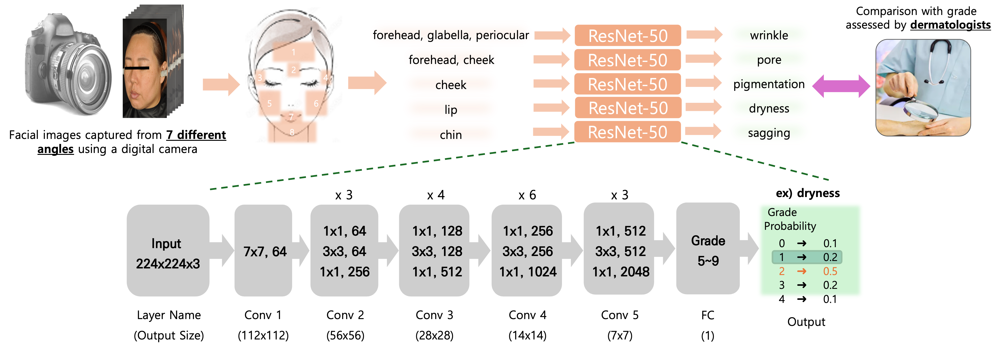
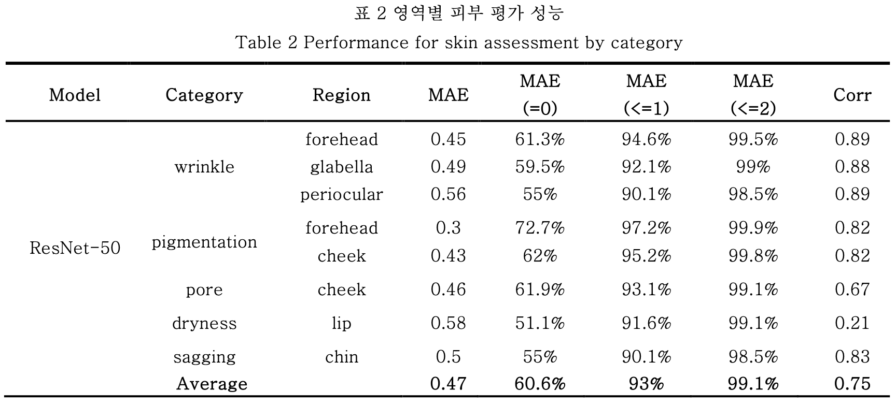
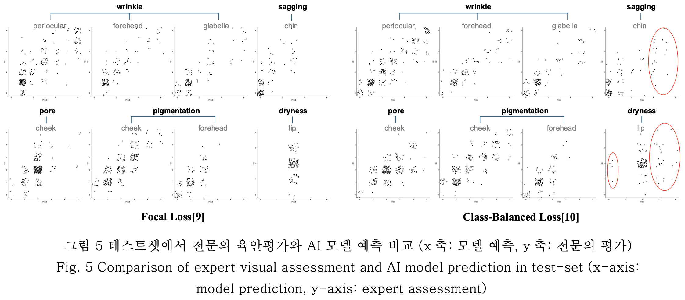

# 🇰🇷 한국인 피부상태 측정 데이터

[](https://leejeongho3214.github.io/NIA)
[](https://www.aihub.or.kr/aihubdata/data/view.do?currMenu=&topMenu=&aihubDataSe=data&dataSetSn=71645)
[](https://www.dbpia.co.kr/journal/articleDetail?nodeId=NODE12252203)
[](https://www.dbpia.co.kr/journal/articleDetail?nodeId=NODE11862094)
[](https://www.dbpia.co.kr/journal/articleDetail?nodeId=NODE12041791)
[](mailto:72210297@dankook.ac.kr)

---
## 🆕 업데이트
**[26/03/21]**
- 모델 checkpoint 및 데이터셋 공유 링크 재업로드

**[25/12/03]** 
- 모델 체크포인트 및 데이터셋 분할 파일 제공
- 학습 및 테스트 코드 수정

## 📌 소개

- **최초의 한국인 피부상태 AI 데이터셋**
- 연령: 10~60대 이상, 남녀 1,100명 참여
- **3가지 촬영 장비**: 디지털 카메라, 스마트패드, 스마트폰
- **최대 7가지 각도**에서 다각도 얼굴 이미지 수집
- 모든 이미지에는 **8개 주요 얼굴 영역의 BBox** 포함
- **전문의 육안 평가 + 정밀 기기 측정값 동시 제공**

---
## 📂 주요 링크

- 📊 [AI-Hub 데이터셋](https://www.aihub.or.kr/aihubdata/data/view.do?currMenu=&topMenu=&aihubDataSe=data&dataSetSn=71645)
- 🆕 [정보과학회 2025 컴퓨팅의 실제 논문지 (KTCP)](https://www.dbpia.co.kr/journal/articleDetail?nodeId=NODE12252203)
- 📄 [정보과학회 2024 KCC (🏅 우수발표논문상)](https://www.dbpia.co.kr/journal/articleDetail?nodeId=NODE11862094)
- 📄 [정보과학회 2024 KSC (🏆 우수논문상)](https://www.dbpia.co.kr/journal/articleDetail?nodeId=NODE12041791)
- 📬 [이메일 문의](mailto:72210297@dankook.ac.kr)

---

## 🗂️ 데이터 구성

### 📷 이미지
- **디지털 카메라**: 7가지 각도
- **스마트패드/폰**: 3가지 각도
- 배경 및 조명 조건 통제

### 🏷️ 라벨링

- **전문의 육안 평가**  
  - 국내 피부과 전문의 5인 참여  
  - 평가 항목: 색소침착, 입술건조도, 모공, 턱선처짐, 주름 등  
  - 항목별 등급 범위 상이

- **정밀 측정 장비값**  
  - SCI급 논문과 식약처 인증 기반  
  - 측정 항목: 모공, 색소침착, 주름, 수분, 탄력

### 🧪 실험 환경
- 세면 후 항온·항습실에서 건조, 촬영
- 디지털 카메라는 암막실에서 얼굴 고정 장치 활용

---

## 🧠 피부 진단 AI 모델

### 📌 모델 구조
- ResNet-50 기반
- 마지막 fc-layer 출력 크기 = 등급 수
- Task별로 분리된 모델 학습 (예: 주름, 모공, 건조도 등)

<p align="center">
  
</p>

### ⚙️ 손실 함수
- Cross-Entropy는 등급 불균형으로 과적합 발생   
→ Focal Loss이나 Class-balanced Loss 사용

### 🏋️‍♀️ 학습 설정
- Optimizer: Adam  
- LR: 0.005  
- Epoch: 100  
- Split: Train/Val/Test = 8:1:1  
- 등급 분포 고려한 stratified split 적용

### 📊 결과 예시

<p align="center">
  
</p>

<p align="center">
  
</p>

---

## 🛠️ 코드 구성

### 이미지 Crop

- CNN 입력을 위해 정사각형 이미지 필요
    - 방법 1: bbox 중심 기준 정사각형 crop  
    - 방법 2: bbox에 zero-padding 추가

- 아래 json 파일로, 안면 이미지에서 새롭게 만든 bbox의 위치값 기준으로 이미지를 crop하고 cropped_img 폴더가 생생

```bash
python tool/img_crop.py
```

### 모델 checkpoint (checkpoint)
https://gofile.me/7wbhv/TaZgLsAag

### 데이터셋 분할 json 파일 (dataset/split)
- 각 Facial sign별로 등급을 기준으로 8:1:1을 랜덤하게 분할
- Seed 1-4개로 구성돼 있음
https://gofile.me/7wbhv/cstOyfCWw

password는 메일로 문의주세요.

### 폴더 구조
```
{$ROOT}
├── checkpoint
│   ├── class
│   └── regression
│      └── 1st_cnn
│         └── save_model
│ 
├── dataset
│   ├── img
│   ├── label
│   ├── split
│   └── cropped_img
│
└── tool
    ├── img_crop.py
    ├── main.py
    └── test.py
```

### 전처리 과정
1. AI-hub에서 다운받은 안면 이미지에서 "img_crop.py" 코드로 영역 이미지를 추출
    - 기존 json 파일에 있는 bbox는 영역에 딱 맞는 크기라, 정사각형으로 resizing 필요
2. 등급을 고르게 학습시키기 위해, split 폴더 안에 train/val/test로 분할한 이미지 정보들이 담김
3. 위 폴더 구조를 만족하면 아래 코드가 정상 동작할 것임

### 학습 코드
```bash
python tool/main.py --name "저장할 체크포인트 이름" --mode class   # 육안평가
python tool/main.py --name "저장할 체크포인트 이름" --mode regression  # 기기 측정값
```

### 테스트 코드

```bash
python tool/test.py --name "저장된 체크포인트 이름" --mode class
python tool/test.py --name "저장된 체크포인트 이름" --mode regression
```

---

## 📬 문의

> 단국대학교 컴퓨터학과 박사과정  
> **이정호** (Jeongho Lee)  
> 📧 [72210297@dankook.ac.kr](mailto:72210297@dankook.ac.kr)

---
