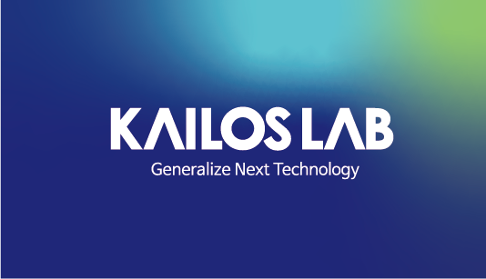
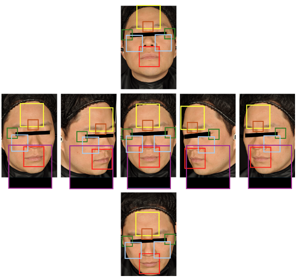
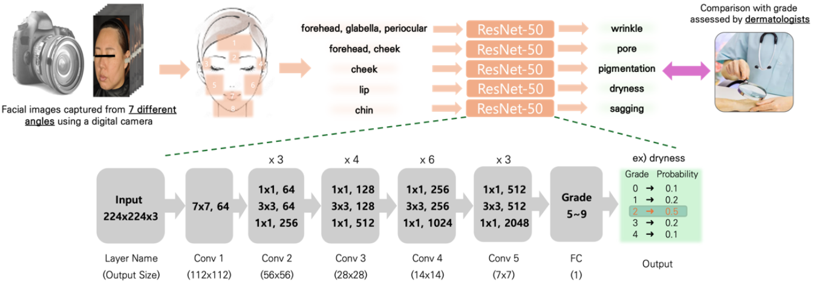
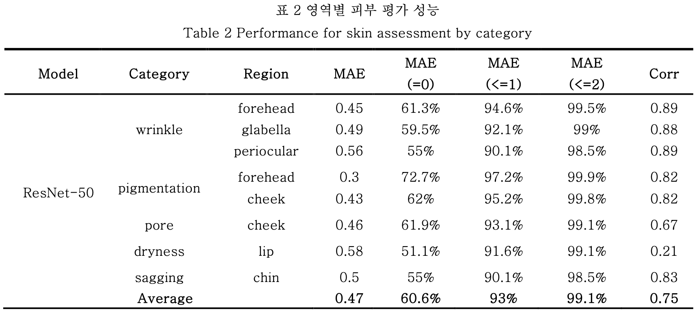
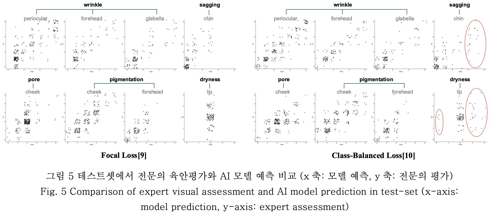

<p align="center">
   
  &nbsp;&nbsp;&nbsp;&nbsp;&nbsp;
   
  &nbsp;&nbsp;&nbsp;&nbsp;&nbsp;
    
  &nbsp;&nbsp;&nbsp;&nbsp;&nbsp;
  
</p>

<h1 align="center">🇰🇷 한국인 피부상태 AI 데이터셋</h1>

<p align="center">
  
  
</p>

<p align="center">
이 프로젝트는 한국인을 대상으로 한 피부 이미지 데이터셋과 안면 피부 상태 평가를 위한 AI 모델을 제공합니다.  
10~60대 이상의 남녀 1,100명을 대상으로 수집한 다각도 이미지와 함께, 피부과 전문의의 육안 평가와 정밀 기기 측정값이 포함되어 있습니다.
</p>

---

## 📂 주요 링크

- 📊 [AI-Hub 데이터셋](https://www.aihub.or.kr/aihubdata/data/view.do?currMenu=&topMenu=&aihubDataSe=data&dataSetSn=71645)
- 📄 [정보과학회 2024 KCC (🏅 우수발표논문상)](https://www.dbpia.co.kr/journal/articleDetail?nodeId=NODE11862094)
- 📄 [정보과학회 2024 KSC (🏆 우수논문상)](https://www.dbpia.co.kr/journal/articleDetail?nodeId=NODE12041791)
- 📬 [이메일 문의](mailto:72210297@dankook.ac.kr)

---

## 🧠 간략 소개

- **장비**: 디지털 카메라, 스마트폰, 태블릿
- **촬영 각도**: 최대 7가지
- **BBox 라벨**: 얼굴 주요 부위 8개
- **평가 정보**:
  - 육안 평가 (전문의 5인)
  - 기기 측정값 (SCI 논문, 식약처 인증 장비)

---

## 💻 코드 실행 예시

```bash
python tool/main.py --name "my_checkpoint" --mode class       # 육안평가
python tool/main.py --name "my_checkpoint" --mode regression  # 기기 측정값
```

---

## 📊 결과 예시

<p align="center">
  <br><br>
  
</p>

---

## 🛠 폴더 구조

```
project_root/
│
├── dataset/
│   ├── img/
│   ├── label/
│   └── cropped_img/
│
└── tool/
    ├── img_crop.py
    ├── main.py
    └── test.py
```

---

## 👤 담당자

- **이정호 (Jeongho Lee)**  
  단국대학교 컴퓨터학과 박사과정  
  📧 [72210297@dankook.ac.kr](mailto:72210297@dankook.ac.kr)

---

## 🗣️ Future work

- 데이터셋 특성 상, 특정 등급에 대부분 분포돼 있는 long-tailed distribution의 모습을 보입니다. 모델의 over-fitting을 방지하기 위해 loss function을 focal loss나 class-balanced loss로 사용하여 어느 정도 방어했지만, 여전히 over-fitting이 남아있습니다.
- 위 문제를 해결하기 위해 다음 시도들을 고려해볼 수 있습니다:
  - 디지털 카메라 외에 스마트폰/패드 이미지를 함께 학습
  - 최신 Classification SOTA 모델 도입
  - Class-imbalance에 강한 loss function 또는 data loader
  - Classification이 아닌 Detection/Segmentation 기반 접근
