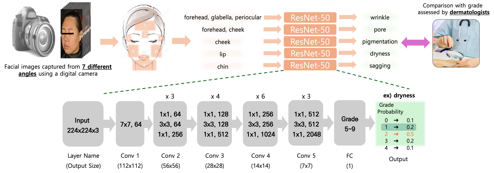

<p align="center">
   
  &nbsp;&nbsp;&nbsp;&nbsp;&nbsp;
   
  &nbsp;&nbsp;&nbsp;&nbsp;&nbsp;
    
  &nbsp;&nbsp;&nbsp;&nbsp;&nbsp;
  
</p>

<h1 align="center"><b>🇰🇷 한국인 피부상태 AI 데이터셋</b></h1>

<p align="center">
  
  
</p>

<p align="center">
이 프로젝트는 한국인을 대상으로 한 피부 이미지 데이터셋과 안면 피부 상태 평가를 위한 AI 모델을 제공합니다.  
10~60대 이상의 남녀 1,100명을 대상으로 수집한 다각도 이미지와 함께, 피부과 전문의의 육안 평가와 정밀 기기 측정값이 포함되어 있습니다.
</p>

---

# 📌 업데이트

**[25/12/03]**
- 모델 체크포인트 및 데이터셋 분할 파일 제공  
- 학습 및 테스트 코드 업데이트  

---

# 📚 소개

- **최초의 한국인 피부상태 AI 데이터셋**
- 연령: **10~60대 이상**, 남녀 **1,100명 참여**
- **3가지 촬영 장비**  
  - 디지털 카메라  
  - 스마트패드  
  - 스마트폰  
- **최대 7가지 촬영 각도**
- **8개 주요 얼굴 영역의 Bounding Box 제공**
- **전문의 육안 평가 + 정밀 측정 장비값 동시 제공**

---

# 📂 주요 링크

- 📊 [AI-Hub 데이터셋](https://www.aihub.or.kr/aihubdata/data/view.do?currMenu=&topMenu=&aihubDataSe=data&dataSetSn=71645)
- 🆕 [2025 정보과학회 KTCP 논문지](https://www.dbpia.co.kr/journal/articleDetail?nodeId=NODE12252203)
- 📄 [2024 KCC — 🏅 우수발표논문상](https://www.dbpia.co.kr/journal/articleDetail?nodeId=NODE11862094)
- 📄 [2024 KSC — 🏆 우수논문상](https://www.dbpia.co.kr/journal/articleDetail?nodeId=NODE12041791)
- 📬 [문의 메일](mailto:72210297@dankook.ac.kr)

---

# 🗂️ 데이터 구성

## 📷 촬영 이미지
- **디지털 카메라**: 7가지 각도  
- **스마트폰/태블릿**: 3가지 각도  
- 배경 및 조명 조건 통제  
- 세면 후 항온·항습 환경에서 촬영  
- 디지털 카메라는 암막실 + 얼굴 고정 장치 활용

## 🏷️ 라벨 구성

### 🧑‍⚕️ 전문의 육안 평가
- 피부과 전문의 5명 참여  
- 평가 항목: 색소침착, 입술건조도, 모공, 턱선처짐, 주름 등  
- 항목별 등급 기준 상이

### 🧪 정밀 측정 장비값
- SCI급 논문 + 식약처 인증 기반  
- 측정 항목: 색소침착, 모공, 주름, 수분, 탄력 등

---

# 🧠 피부 진단 AI 모델

## 모델 구조
- ResNet-50 기반  
- 최종 FC Layer 출력 = 각 Task 등급 수  
- Task(주름/모공/건조도 등)별 개별 모델 학습

<p align="center">
  
</p>

## ⚙️ 손실 함수
- 단순 CE Loss → 클래스 불균형으로 과적합 발생  
→ **Focal Loss / Class-balanced Loss**로 개선

## 🏋️‍♀️ 학습 설정
- Optimizer: Adam  
- LR: 0.005  
- Epoch: 100  
- Train/Val/Test = 8:1:1  
- **Stratified Split 적용**

---

# 📊 결과 예시

<p align="center">
  <br><br>
  
</p>

---

# 🛠️ 코드 구성

## ✔ 이미지 Crop

- CNN 입력을 위한 정사각형 이미지 생성 필요  
- 기존 bbox는 정사각형이 아니므로 crop + padding 수행  
- json 파일 기준으로 crop된 이미지가 `cropped_img/`에 저장됨

실행:

```bash
python tool/img_crop.py
```

## ✔ 모델 Checkpoint
👉 [📦 모델 Checkpoint 다운로드](https://gofile.me/7wbhv/ulS4DItdK)

## ✔ 데이터셋 분할 파일 (dataset/split)
👉 [🗂️ 데이터셋 Split 다운로드](https://gofile.me/7wbhv/9lHdNM1yU)

password는 이메일로 문의해주세요.

## 📁 폴더 구조
```
project_root/
│
├── checkpoint/
│   ├── class/
│   └── regression/
│       └── 1st_cnn/
│           └── save_model/
│
├── dataset/
│   ├── img/
│   ├── label/
│   ├── split/
│   └── cropped_img/
│
└── tool/
    ├── img_crop.py
    ├── main.py
    └── test.py

```
### 🔧 전처리 과정
1. AI-hub에서 다운받은 안면 이미지에서 "img_crop.py" 코드로 영역 이미지를 추출
    - 기존 json 파일에 있는 bbox는 영역에 딱 맞는 크기라, 정사각형으로 resizing 필요
2. 등급을 고르게 학습시키기 위해, split 폴더 안에 train/val/test로 분할한 이미지 정보들이 담김
3. 위 폴더 구조를 만족하면 아래 코드가 정상 동작할 것임

### 🔧 학습 코드
```bash
python tool/main.py --name "저장할 체크포인트 이름" --mode class   # 육안평가
python tool/main.py --name "저장할 체크포인트 이름" --mode regression  # 기기 측정값
```

### 🧪 테스트 코드

```bash
python tool/test.py --name "저장된 체크포인트 이름" --mode class
python tool/test.py --name "저장된 체크포인트 이름" --mode regression
```

---

## 👤 문의

> 단국대학교 컴퓨터학과 박사과정  
> **이정호** (Jeongho Lee)  
> 📧 [72210297@dankook.ac.kr](mailto:72210297@dankook.ac.kr)

---
